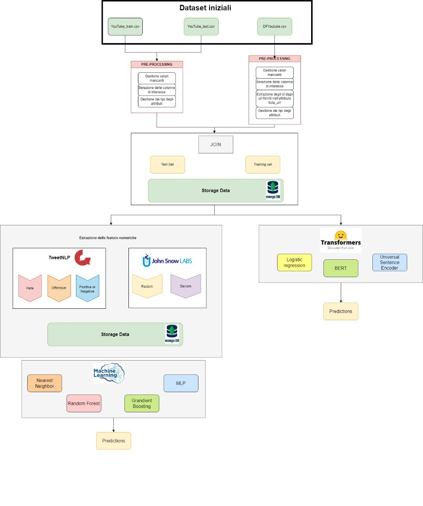

# Sentiment-Analysis-on-Youtube-Video-through-Twitter: An NLP-approach

## 1. Introduction

Social media platforms play a significant role in shaping the modern digital information ecosystem by allowing users to contribute to discussions on a wide range of topics. However, the freedom of expression offered by these platforms can potentially threaten the integrity of these information ecosystems when harmful content (e.g., fake news, hateful speech) is shared and propagates across the digital population.

To overcome this problem, mainstream social media platforms (e.g., Facebook and Twitter) deploy diverse moderation interventions to target both inappropriate content and the users responsible for spreading it. However, these moderation efforts are typically enacted in a siloed fashion, largely overlooking other platforms' interventions on harmful content that has migrated to their spaces. This approach poses risks as any harmful content originating on a source platform can migrate to other target platforms, gaining traction with specific communities and reaching a wider audience. Cooperation among social media platforms is therefore desirable but also practically valuable: knowing what content has been deemed inappropriate on another platform can inform moderation strategies or help with the early detection of similarly harmful or related content.

The general objective of the challenge is to assess the validity of the above-mentioned statement. Specifically, we consider YouTube (YT) and Twitter as the source and target platforms. The aim of this challenge is to predict whether a YouTube video shared on Twitter will be removed by YouTube.

## 2. Data

The dataset comprises three files:

- `train.csv`: a table with three columns, i.e., the video identifier, the video URL(s) (the same video can be shared through different URLs), the video status (the video could either be moderated or not moderated).
- `test.csv`: it shares the same structure as `train.csv` without the last column.
- `df_youtube.csv.zip`: the archive with all tweets sharing the videos listed in the above-mentioned files.

## 3. Pipeline Description

## 4. Pipeline Description
The files are organized as follows:
1. Join between train/test table and df_youtube table.
2. Feature Extraction Through TweetNLP
3. Feature Extraction Through John Snow LABS Cyberbullying Model
4. Join between Feature extracted
5. Train ML model
6. Train Transformer Model to achieve the goal
